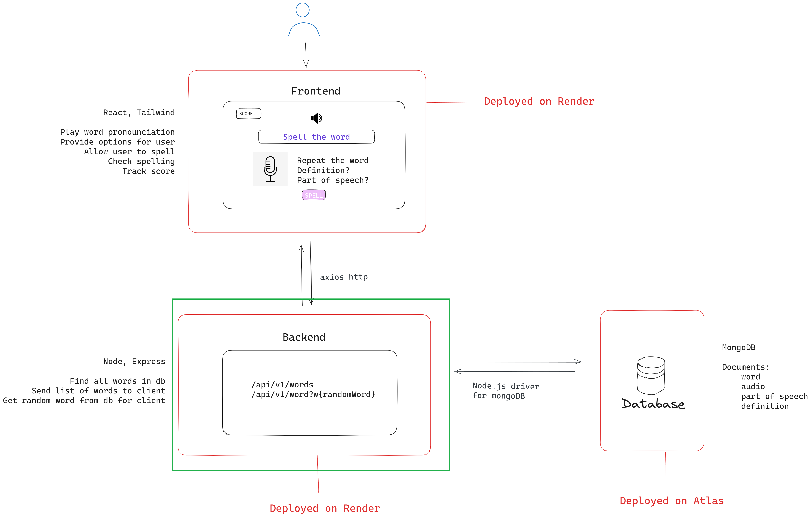

# Spellingbee Backend

This is the backend code of an online game in which the user the POV of being in a spellingbee.

## Software Diagram

A software diagram showing the backend in the context of the full project.

## Usage
The game can be played on: https://spellingbee.onrender.com/

## Author

- Raphael

Feel free to report issues and provide feedback!